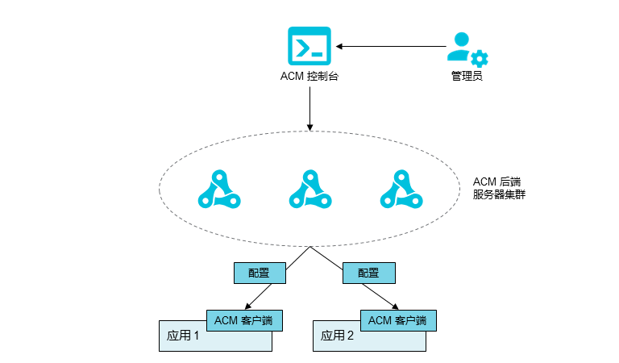

## nacos

### 概览
英文全称Dynamic Naming and Configuration Service，Na为naming/nameServer即注册中心,co为configuration即注册中心，service是指该注册/配置中心都是以服务为核心。服务在nacos是一等公民

Nacos 致力于帮助您发现、配置和管理微服务。Nacos 提供了一组简单易用的特性集，帮助您快速实现动态服务发现、服务配置、服务元数据及流量管理。

nacos脑图：


### 使用方式
1. 从 Github 上下载源码方式
    ```shell script
    git clone https://github.com/alibaba/nacos.git
    cd nacos/
    mvn -Prelease-nacos -Dmaven.test.skip=true clean install -U  
    ls -al distribution/target/
    
    // change the $version to your actual path
    cd distribution/target/nacos-server-$version/nacos/bin
    ```
1. 下载编译后压缩包方式

    您可以从 [最新稳定版本](https://github.com/alibaba/nacos/releases) 下载 nacos-server-$version.zip 包。
    ```shell script
     unzip nacos-server-$version.zip 或者 tar -xvf nacos-server-$version.tar.gz
     cd nacos/bin
    ```
1. 启动服务器
    Linux/Unix/Mac
    启动命令(standalone代表着单机模式运行，非集群模式):
    
    `sh startup.sh -m standalone`
    
    如果您使用的是ubuntu系统，或者运行脚本报错提示[[符号找不到，可尝试如下运行：
    
    bash startup.sh -m standalone
    
    Windows
    启动命令(standalone代表着单机模式运行，非集群模式):
    
    `cmd startup.cmd -m standalone`

1. 启动过程注意点
    1. 环境准备要严格，因为开发任务使用到的工具需要32位jdk，我修改了环境变量，所以导致启动后无法访问管理系统的情况。
        ```
        Nacos 依赖 Java 环境来运行。如果您是从代码开始构建并运行Nacos，还需要为此配置 Maven环境，请确保是在以下版本环境中安装使用:
        
        64 bit OS，支持 Linux/Unix/Mac/Windows，推荐选用 Linux/Unix/Mac。
        64 bit JDK 1.8+；下载 & 配置。
        Maven 3.2.x+；下载 & 配置。
        ```
    1. 启动过程比较慢，出现以下信息，表示完全启动成功，访问控制台的地址：http://192.168.1.6:8848/nacos/index.html
        ```
        2020-12-13 22:04:12,368 INFO Nacos started successfully in stand alone mode. use embedded storage
        ```
    1. jdk环境变量设置问题
        ```
        因为windows下，JDK8之后默认创建了一个相关命令的快捷方式文件夹：C:\Program Files (x86)\Common Files\Oracle\Java\javapath
        并且将该目录给设置了在了环境变量最前面，如果多JDK安装时，则需要注意了，该文件夹和环境变量里的配置都可以删除。
        直接使用最原始的%JAVA_HOME%配置，因为很多依赖JDK的程序都会默认找这个环境变量，最稳妥的环境变量设置方式。
        ```

### 配置中心(ACM-Application Configuration Management)
分布式架构环境中对应用配置进行集中管理和推送的管理服务系统。
凭借配置变更、配置推送、历史版本管理、灰度发布、配置变更审计等配置管理工具，集中管理所有应用环境中的配置，降低分布式系统中管理配置的成本，并降低因错误的配置变更造成可用性下降甚至发生故障的风险。

传统配置，以Spring体系为例，通常都配置到application.properties里，通过注解或者其他方式进行使用，一旦涉及配置变更，往往需要登录服务器，修改配置后重新启动服务刷新配置。
如果机器管理严格的话，往往无法直接访问服务器，需要联系运维操作，流程更是繁琐。如果是集群部署，则需要每一台配置都需要手动修改。或者借助发布平台重新修改代码提交发布包批量发布。


在ACM的配置管理场景下，只需要在ACM控制台上更改配置，配置信息就会自动被推送到各个服务器中，并在数秒内生效。

#### 系统架构
ACM产品包括三个主要部分：客户端、后端服务器集群和用于配置管理的控制台。


#### 使用场景
建议配置需要频繁变更或者需要动态修改的配置，与传统配置结合使用。当然传统配置和ACM配置有一个使用的大背景，就是有环境区分

| 配置方式  | 使用场景 | 备注 |
| ----- | ---- | ---- |
| 传统配置 | 固定配置，几乎不会变更的配置 | 短信模板ID， |
| ACM配置 | 动态修改，频繁变更 | 降级开关，非法字符，XSS规则-经常出现变种 |

### 目录说明
1. `img文件夹`：存储markdown文件所使用的到的图片
2. `script文件夹`：存储使用到的一些脚本，方便开发过程使用
    1. `start nacos.bat`：启动nacos服务需要进入nacos的安装目录，执行对应的脚本，直接将这个过程脚本化，放在桌面，减少操作路径。可自行根据需要修改nacos服务安装目录。
    1. `set jdk 1.8.bat`:windows下切换jdk脚本，因为同时使用到不同的jdk依赖，修改操作路径脚本化。

### 参考
1. [官方网址](http://nacos.io)
1. [应用配置管理 ACM
](https://help.aliyun.com/document_detail/59953.html?spm=a2c4g.11186623.6.542.7d4f24c7KLV05q)

### 问题待解决及计划
1. 完成配置中心功能。
2. nacos源码部分依赖无法通过maven下载，初步分析和maven镜像有关，后续再分析解决。