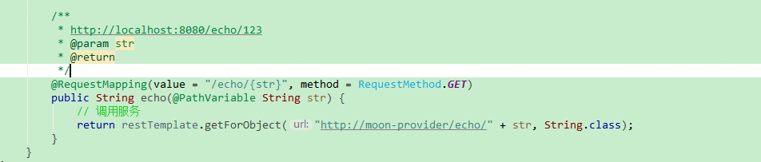

## nacos

### 概览
英文全称Dynamic Naming and Configuration Service，Na为naming/nameServer即注册中心,co为configuration即注册中心，service是指该注册/配置中心都是以服务为核心。服务在nacos是一等公民

Nacos 致力于帮助您发现、配置和管理微服务。Nacos 提供了一组简单易用的特性集，帮助您快速实现动态服务发现、服务配置、服务元数据及流量管理。

nacos脑图：


### 使用方式
1. 从 Github 上下载源码方式
    ```shell script
    git clone https://github.com/alibaba/nacos.git
    cd nacos/
    mvn -Prelease-nacos -Dmaven.test.skip=true clean install -U  
    ls -al distribution/target/
    
    // change the $version to your actual path
    cd distribution/target/nacos-server-$version/nacos/bin
    ```
1. 下载编译后压缩包方式

    您可以从 [最新稳定版本](https://github.com/alibaba/nacos/releases) 下载 nacos-server-$version.zip 包。
    ```shell script
     unzip nacos-server-$version.zip 或者 tar -xvf nacos-server-$version.tar.gz
     cd nacos/bin
    ```
1. 启动服务器
    Linux/Unix/Mac
    启动命令(standalone代表着单机模式运行，非集群模式):
    
    `sh startup.sh -m standalone`
    
    如果您使用的是ubuntu系统，或者运行脚本报错提示[[符号找不到，可尝试如下运行：
    
    bash startup.sh -m standalone
    
    Windows
    启动命令(standalone代表着单机模式运行，非集群模式):
    
    `cmd startup.cmd -m standalone`
    
    或者下载源码后，不编译，直接运行源码工程启动也可以：`com.alibaba.nacos.Nacos`
    
    
1. 启动过程注意点
    1. 环境准备要严格，因为开发任务使用到的工具需要32位jdk，我修改了环境变量，所以导致启动后无法访问管理系统的情况。
        ```
        Nacos 依赖 Java 环境来运行。如果您是从代码开始构建并运行Nacos，还需要为此配置 Maven环境，请确保是在以下版本环境中安装使用:
        
        64 bit OS，支持 Linux/Unix/Mac/Windows，推荐选用 Linux/Unix/Mac。
        64 bit JDK 1.8+；下载 & 配置。
        Maven 3.2.x+；下载 & 配置。
        ```
    1. 启动过程比较慢，出现以下信息，表示完全启动成功，访问控制台的地址：http://192.168.1.6:8848/nacos/index.html
        ```
        2020-12-13 22:04:12,368 INFO Nacos started successfully in stand alone mode. use embedded storage
        ```
    1. jdk环境变量设置问题
        ```
        因为windows下，JDK8之后默认创建了一个相关命令的快捷方式文件夹：C:\Program Files (x86)\Common Files\Oracle\Java\javapath
        并且将该目录给设置了在了环境变量最前面，如果多JDK安装时，则需要注意了，该文件夹和环境变量里的配置都可以删除。
        直接使用最原始的%JAVA_HOME%配置，因为很多依赖JDK的程序都会默认找这个环境变量，最稳妥的环境变量设置方式。
        ```

### nacos功能
1. 分布式配置中心：该功能对应ACM。严格意义上的ACM和nacos还是有区别的，本文不做区分，主要侧重分布式配置上的功能性上。
1. 服务注册与发现：该功能对应企业级分布式应用服务EDAS中的注册中心。

### Nacos Server功能拆分部署
#### 为什么要拆分部署
一般公司随着业务规模的不断膨胀，我们建议业务对注册中心和配置中心进行拆分部署，在Nacos 0.9.0版本以后，支持注册中心模块和配置中心模块的拆分部署，在启动命令进行加入参数，来指定启动指定Nacos 功能模块，默认全部功能启用，目前支持指定配置中心模块和注册中心模块。

#### 使用方法
启动Nacos server时候，增加-f参数，意思是function mode，和对应模块标示来进行启动，如果不传，或者传入有误，都将启动全部功能。 配置中心参数对应config，注册中心参数对应naming。

#### 启动命令
`startup.cmd -m standalone -f naming`


### 修改存储数据源
切换数据源，默认使用derby存储数据，修改为使用单独部署的Mysql存储数据
1. 创建数据库
    ```sql
    create database if not exists nacos default charset utf8 collate utf8_general_ci;
    ```
1. 建表：执行自带的脚本，${nacos_install_dir}/conf/nacos-mysql.sql
1. 运行时发现有版本要求，1.0.0RC3还是只能使用Mysql5，从源码里的mysql-connector-java依赖版本可以看出，Mysql8启动直接报错。
1. 下载最新的开发分支代码，2.0.0，发现mysql-connector-java版本为8+，直接使用功能mvn打出使用包，修改相关配置，启动即可。需要注意的是时区不能写错`serverTimezone=GMT%2B8`，否则也连接不上，和不支持Mysql8的现象一样，易被误导，不容易找到原因。
    ```sql
    # 切换独立Mysql数据库存储配置信息
    spring.datasource.platform=mysql
    db.num=1
    db.url.0=jdbc:mysql://127.0.0.1:3306/nacos?characterEncoding=utf8&connectTimeout=1000&socketTimeout=3000&autoReconnect=true&useUnicode=true&useSSL=false&serverTimezone=GMT%2B8
    db.user=root
    db.password=root
    ```

### 服务集群配置
TODO

### 配置中心(ACM-Application Configuration Management)
分布式架构环境中对应用配置进行集中管理和推送的管理服务系统。
凭借配置变更、配置推送、历史版本管理、灰度发布、配置变更审计等配置管理工具，集中管理所有应用环境中的配置，降低分布式系统中管理配置的成本，并降低因错误的配置变更造成可用性下降甚至发生故障的风险。

传统配置，以Spring体系为例，通常都配置到application.properties里，通过注解或者其他方式进行使用，一旦涉及配置变更，往往需要登录服务器，修改配置后重新启动服务刷新配置。
如果机器管理严格的话，往往无法直接访问服务器，需要联系运维操作，流程更是繁琐。如果是集群部署，则需要每一台配置都需要手动修改。或者借助发布平台重新修改代码提交发布包批量发布。


在ACM的配置管理场景下，只需要在ACM控制台上更改配置，配置信息就会自动被推送到各个服务器中，并在数秒内生效。


#### 系统架构
ACM产品包括三个主要部分：客户端、后端服务器集群和用于配置管理的控制台。


原理：


#### 使用场景
建议配置需要频繁变更或者需要动态修改的配置，与传统配置结合使用。当然传统配置和ACM配置有一个使用的大背景，就是有环境区分。
一般不区分环境的变更直接使用常量即可。

| 配置方式  | 使用场景 | 备注 |
| ----- | ---- | ---- |
| 传统配置 | 固定配置，几乎不会变更的配置 | 短信模板ID|
| ACM配置 | 动态修改，频繁变更 | 降级开关(大促、上线重大功能)，非法字符，XSS规则-经常出现变种 |

#### ACM价值/优点
1. 集中管理所有配置，在应用众多的情况下配置管理变得更加方便。
1. 所有配置不依赖版本发布，使配置更新变得更加灵活。
1. 更新的配置秒级自动下发到各客户端，降低配置手动分发的工作量。
1. 通过接入ACM配置监听接口，各应用中的客户端的配置可立即生效，无需重启应用。
1. 所有配置监听、更改和版本信息自动记录在案，增强了审计、版本管理和诊断等方面的能力。
1. 支持灰度发布和回滚，使得配置的变更发布在微服务架构下变得更加安全。

#### ACM实现的核心
##### 配置监听
实时变更：ACM允许系统通过使用SDK等方式向ACM系统注册监听器（Listener），从而监听并消费该配置的变更。

##### 高可用
配置快照：客户端SDK会在本地生成配置的快照。当客户端无法连接到ACM Server时，可以利用快照提供系统的整体容灾能力。配置快照类似于Git中的本地commit的概念，也类似缓存，会在适当的时机更新，但是没有缓存过期（expire）的概念。

#### 核心概念/关键词
##### 命名空间（Namespace）
用于进行租户粒度的配置隔离。不同的命名空间下，可以存在相同的Group，Data ID的配置。

Namespace的常用场景之一是不同环境的配置的区分隔离，如开发测试环境和生产环境的配置隔离等。

##### 配置分组（Group）
使用一个有意义的字符串来分组配置集，例如Buy，Trade等，用以区分相同Data ID的配置集。ACM创建配置时，如果用户未填Group名字，则默认用DEFAULT_GROUP代替。

Group的常用场景是同一个配置类型用于不同应用/系统/组件，如database_url配置，MQ_topic配置等。

##### 配置集ID（Data ID）
通过Data ID来组织划分系统的配置集。一个系统或者应用可以包含多个配置集，每个配置集可以用有意义的名称来标识这个配置集。**个人理解就是等同于配置文件。**

使用场景一般是应用类具有相似属性或者维度的配置，比如日志的配置文件，redis的配置文件等，一般一个应用的配置文件有限，一目了然，不会配置成一样的，也不允许。当然也可以使用官方所说的配置规则，个人认为没必要，因为本身已经通过Group（系统/应用）进行区分了，那样反而不易读。
> Data ID通常采用类Java包命名方式（如com.taobao.tc.refund.log.level）的命名规则保证全局唯一性，此命名规则非强制。

示例：


#### 学习关键点
1. 必要软件下载，配置环境搭建
1. 使用配置功能，了解核心概念
1. 客户端代码学习
    1. 简单客户单使用示例，读取配置内容。`org.moonzhou.alibaba.learning.nacos.NacosClient001`
    1. 读取配置内容，同时添加监听服务端修改。`org.moonzhou.alibaba.learning.nacos.NacosClient002`
    1. 添加监听读取配置内容，同时监听也可以被移除，移除后无法监听配置的修改。`org.moonzhou.alibaba.learning.nacos.NacosClient003`
    1. 发布配置：通过程序自动发布 Nacos 配置，以便通过自动化手段降低运维成本。
        ```
        # 创建和修改配置时使用的同一个发布接口，当配置不存在时会创建配置，当配置已存在时会更新配置。
        # 注意指定类型在后台管理界面上，没有显示出指定的类型
        # 读取配置超时或网络异常，抛出 NacosException 异常。
        org.moonzhou.alibaba.learning.nacos.NacosClient004
        ```
    1. 删除配置：通过程序自动删除 Nacos 配置，以便通过自动化手段降低运维成本。
        ```
        # 当配置已存在时会删除该配置，当配置不存在时会直接返回成功消息。
        org.moonzhou.alibaba.learning.nacos.NacosClient005
        ```
    1. 组合示例：`org.moonzhou.alibaba.learning.nacos.NacosExample`

#### spring cloud 示例
1. 添加依赖：注意点仍然是版本对应，[官方版本说明wiki](https://github.com/alibaba/spring-cloud-alibaba/wiki/%E7%89%88%E6%9C%AC%E8%AF%B4%E6%98%8E)
    ```xml
    <dependency>
        <groupId>com.alibaba.cloud</groupId>
        <artifactId>spring-cloud-starter-alibaba-nacos-config</artifactId>
    </dependency>
    ```
1. 配置文件bootstrap.yml，配置 Nacos server 的地址和应用名
    ```yaml
    server:
      port: 8090
    
    spring:
      application:
        name: moon-nacos-spring-cloud-config-demo
      cloud:
        nacos:
          config:
            prefix: moon-nacos-config
            server-addr: 10.19.38.5:8848 # 配置中心地址
            file-extension: yaml
    ```
    需要注意的是，dataId的规则格式：`${prefix}-${spring.profiles.active}.${file-extension}`
    * prefix 默认为 spring.application.name 的值，也可以通过配置项 spring.cloud.nacos.config.prefix来配置。
    * spring.profiles.active 即为当前环境对应的 profile，详情可以参考 Spring Boot文档。 注意：当 spring.profiles.active 为空时，对应的连接符 - 也将不存在，dataId 的拼接格式变成 ${prefix}.${file-extension}
    * file-exetension 为配置内容的数据格式，可以通过配置项 spring.cloud.nacos.config.file-extension 来配置。目前只支持 properties 和 yaml 类型。

1. 通过 Spring Cloud 原生注解 @RefreshScope 实现配置自动更新
    ```java
    @RestController
    @RequestMapping("/config")
    @RefreshScope
    public class ConfigController {
    
        /**
         * 对应nacos server里的配置内容，yml格式的
         * dataId： <code>${prefix}-${spring.profiles.active}.${file-extension}</code>
         *     prefix 默认为 spring.application.name 的值，也可以通过配置项 spring.cloud.nacos.config.prefix来配置。
         * group: DEFAULT_GROUP
         *
         * RefreshScope自动刷新，监听服务端的配置修改
         */
        @Value("${useLocalCache:false}")
        private boolean useLocalCache;
    
        /**
         * http://localhost:8090/config/get
         * http://192.168.1.6/:8090/config/get
         */
        @RequestMapping("/get")
        public boolean get() {
            return useLocalCache;
        }
    }
    ```
    
    


### 注册中心
#### 说明
以Java nacos client v1.0.1 为例子，服务注册的策略的是每5秒向nacos server发送一次心跳，心跳带上了服务名，服务ip，服务端口等信息。同时 nacos server也会向client 主动发起健康检查，支持tcp/http检查。如果15秒内无心跳且健康检查失败则认为实例不健康，如果30秒内健康检查失败则剔除实例。

原理示意图：


#### 实例操作步骤
1. 启动nacos服务
2. 搭建服务提供方，将服务注册到nacos服务里
    * 示例:
        * spring cloud: `nacos-spring-cloud/nacos-spring-cloud-discovery/nacos-spring-cloud-provider`
    * 注意点：springboot-springcloud-springcloud alibaba的版本需要按照规则引入，否则服务无法注册。[官方版本说明wiki](https://github.com/alibaba/spring-cloud-alibaba/wiki/%E7%89%88%E6%9C%AC%E8%AF%B4%E6%98%8E)
        
3. 搭建服务消费方，将消费方注册到nacos服务里
    * 示例：
        * spring cloud: `nacos-spring-cloud/nacos-spring-cloud-discovery/nacos-spring-cloud-consumer`
4. 均在nacos服务配置中心注册成功后，可以直接调用消费方对外提供的http接口，消费方通过注册服务直接调用到服务提供方。   
    * 注册成功
        
    * 调用示例
        
    * 调用成功
        

### 目录说明
1. `img文件夹`：存储markdown文件所使用的到的图片
1. `nacosConf`：nacos上配置的示例，配合代码使用。直接导入后，可直接运行各个示例代码。
2. `script文件夹`：存储使用到的一些脚本，方便开发过程使用
    1. `start nacos.bat`：启动nacos服务需要进入nacos的安装目录，执行对应的脚本，直接将这个过程脚本化，放在桌面，减少操作路径。可自行根据需要修改nacos服务安装目录。
    1. `set jdk 1.8.bat`:windows下切换jdk脚本，因为同时使用到不同的jdk依赖，修改操作路径脚本化。
    1. `mysql.bat`：windows下启动mysql服务以及对应的客户端连接工具批处理命令，因为为了提高windows运行性能，mysql服务通常设置为手动启动，而且手动开启时需要到服务里查找，步骤较多。因此通过脚本简化操作步骤。
1. src为正常nacos示例的java代码，使用功能maven构建。

### 参考
1. [官方网址](http://nacos.io)
1. [应用配置管理 ACM
](https://help.aliyun.com/document_detail/59953.html?spm=a2c4g.11186623.6.542.7d4f24c7KLV05q)
1. [什么是Nacos？Nacos注册配置中心介绍](https://www.jianshu.com/p/39ade28c150d)
1. [Nacos 0.9.0 发布，稳定的快速迭代](https://nacos.io/en-us/blog/nacos0.9.0.html)
1. [nacos使用demo](https://github.com/nacos-group/nacos-examples.git)

### 问题待解决及计划
1. 完成配置中心功能。
    1. 读取服务端配置（done）
    1. 添加监听（done）
    1. 发布和删除配置服务（done）
2. nacos源码部分依赖无法通过maven下载，初步分析和maven镜像有关，后续再分析解决。
    > 已解决，maven配置问题，因为settings.xml配置过多，未一一查找，直接使用公司maven仓库可以下载全量用到的jar包。
1. 服务集群配置（伪集群）
1. 服务注册

### 示例代码
[My Hub](https://github.com/moon-zhou/alibaba/tree/main/nacos)